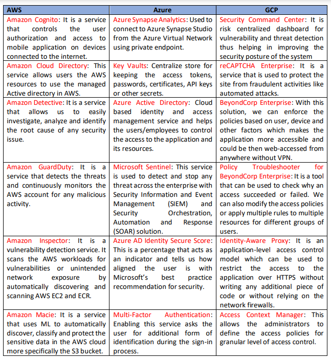
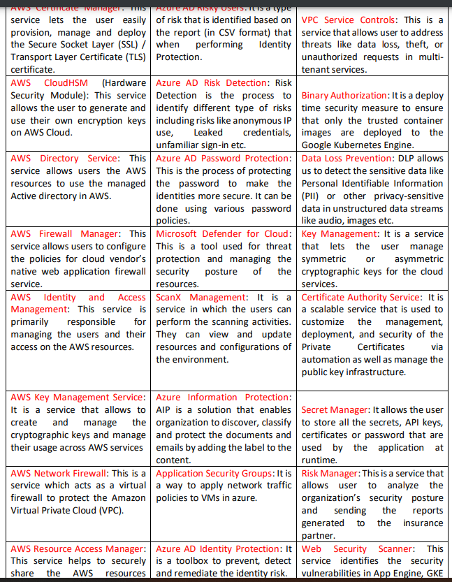
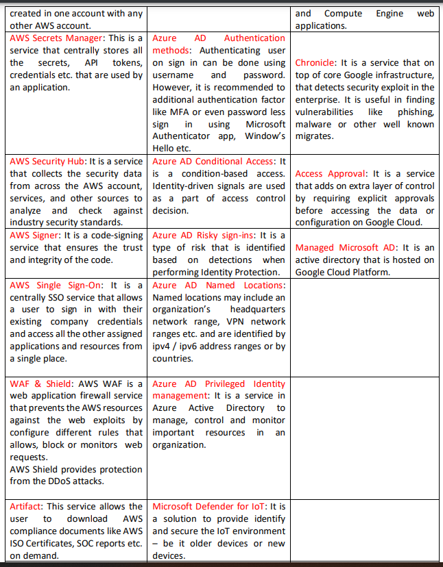
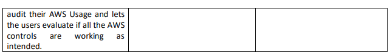
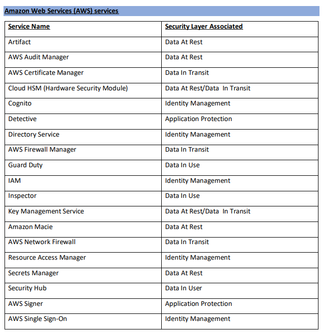
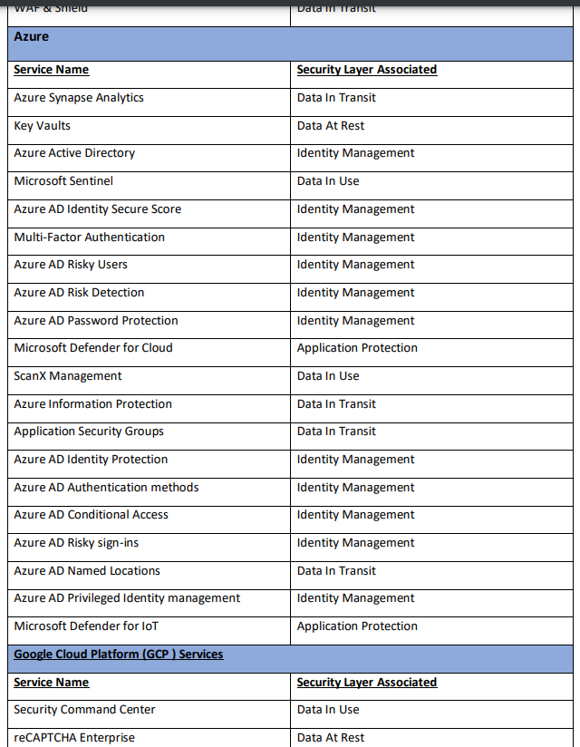
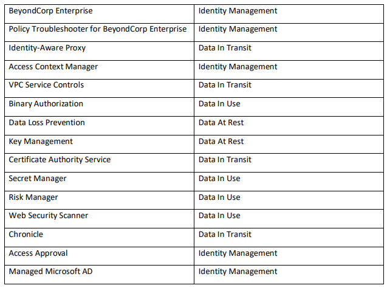

## INTRODUCTION
Layered security refers to security systems that use multiple components, to protect operations on multiple levels, or layers. The central idea behind layered security or defense, is that in order to protect systems from a broad range of attacks, using multiple strategies will be more effective. This document provides a review of the security options offered by three cloud vendors - Amazon Web Services, Microsoft Azure and Google Cloud Platform.

## FEATURES OF THE SERVICES
We can view the features below

## MAPPING THE SERVICES TO SECURITY LAYERS
Map these services to respective security layers (Data in transit, Data at rest, Data in use, DB protection, application protection and identity management) - in tabular format

